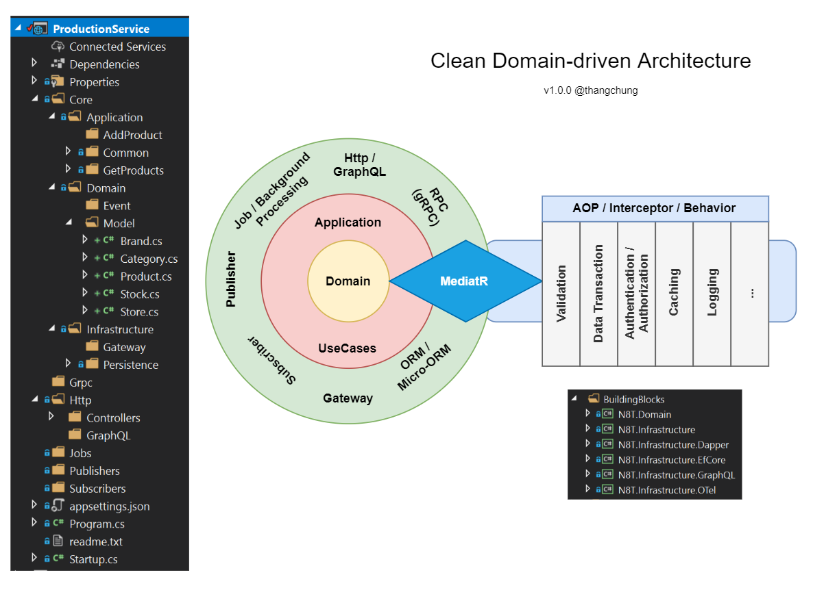

# modernstore project

A store application uses modern technologies such as Dapr, OSM, Tye...

# Get starting

> dotnet --version 5.0.100-rc.1.20452.10

> tye --version 0.5.0-alpha.20468.1+3402fbddeea6a31310c181b48a6281f84865aabc

> dapr --version CLI version: 0.10.0 Runtime version: 0.10.0

> osm version Version: v0.3.0; Commit: c91c782; Date: 2020-08-12-21:49

```bash
$ tye run
```

```bash
$ cd modernstore\src\ProductionService
$ dotnet run
```

```bash
$ cd modernstore\src\SaleService
$ dotnet run
```

```bash
$ cd modernstore\src\Gateway
$ dotnet run
```

Now we can use `restclient.http` to test the application. Happy hacking!

# Clean Domain-driven Architecture



# Database schema

The database schema is inspired from sqlservertutorial project at https://www.sqlservertutorial.net/sql-server-sample-database/
